# 🎓 College Management System

A full-stack college management system built with **React (frontend)**, **Django REST Framework (backend)**, and **MySQL** for persistent storage. It supports secure login and **role-based access** for Admin, Faculty, and Students with clean dashboards and modular access.

---

## 🚀 Features

- 🔐 JWT-based login authentication
- 👥 Separate dashboards for Admin, Faculty, and Student
- 🎯 Role-Based Access Control (RBAC)
- 👨‍🎓 Student and Faculty Management
- 📚 Department & Course CRUD
- 📝 Enrollments with grades (faculty-managed)
- 🧪 Exam creation and schedules
- 📊 Result upload (faculty) and viewing (students)
- 🖥️ Responsive design with Bootstrap
- 🧭 Navbar navigation with logout

---

## 👤 User Roles & Permissions

| Module       | Admin        | Faculty                                         | Student                 |
|--------------|--------------|-------------------------------------------------|-------------------------|
| Students     | ✅ Full CRUD  | ❌ No access                                    | ❌ No access            |
| Departments  | ✅ Full CRUD  | ❌ No access                                    | ❌ No access            |
| Courses      | ✅ Full CRUD  | ✅ View + Manage own courses only               | ✅ View only            |
| Faculty      | ✅ Full CRUD  | ✅ View/edit own profile only                   | ❌ No access            |
| Enrollment   | ✅ Full CRUD  | ✅ View own courses' students + update grades   | ✅ View own enrollments |
| Exams        | ✅ Full CRUD  | ✅ CRUD for own course exams                    | ✅ View own exams       |
| Results      | ✅ Full CRUD  | ✅ Create/Update for own course exams           | ✅ View own results     |

---

## 🛠️ Tech Stack

### Frontend
- React.js
- React Router DOM
- Axios
- Bootstrap

### Backend
- Django
- Django REST Framework
- Simple JWT (Authentication)
- CORS Headers

### Database
- MySQL (with Django ORM)

---

## 📁 Folder Structure

```

college\_management\_system/
├── backend/
│   ├── manage.py
│   ├── requirements.txt
│   ├── .env
│   ├── authentication/
│   ├── students/
│   ├── faculty/
│   ├── courses/
│   ├── departments/
│   ├── enrollment/
│   ├── exams/
│   ├── results/
│   └── college\_management\_system/  # Django settings, urls
│
├── frontend/
│   ├── public/
│   ├── src/
│   │   ├── components/
│   │   ├── pages/
│   │   ├── services/
│   │   ├── App.js
│   │   └── index.js
│   └── package.json
│
├── venv/ (Git Ignored)
├── .gitignore
└── README.md

````

---

## 💻 Installation & Setup

### 1️⃣ Clone the Repository

```bash
git clone https://github.com/Pavithra-Christy/college-management-system.git
cd college_management_system
````

---

### 2️⃣ Backend Setup (Django)

```bash
cd backend
python -m venv venv

# Activate virtual environment:
# On Windows:
venv\Scripts\activate
# On macOS/Linux:
source venv/bin/activate

pip install -r requirements.txt
python manage.py migrate
python manage.py createsuperuser
python manage.py runserver
```

---

### 3️⃣ Frontend Setup (React)

```bash
cd ../frontend
npm install
npm start
```

* React runs at: `http://localhost:3000`
* Django runs at: `http://127.0.0.1:8000`

---

## 🔐 Authentication & Workflow

* Admin logs in via Django superuser
* Faculty & Students log in using pre-registered email
* Email check: login allowed only if user exists in DB
* JWT token saved to `localStorage`
* Frontend shows dashboard based on user role
* Logout option is available in the responsive navbar

---

## 📊 Sample API Endpoints

| Endpoint          | Method | Description          |
| ----------------- | ------ | -------------------- |
| /api/auth/token/  | POST   | Login (JWT)          |
| /api/students/    | GET    | List all students    |
| /api/faculty/     | GET    | List all faculty     |
| /api/courses/     | GET    | List all courses     |
| /api/departments/ | GET    | List all departments |
| /api/enrollment/  | GET    | View enrollments     |
| /api/exams/       | GET    | View exam schedule   |
| /api/results/     | GET    | View results         |

---

## 📌 Notes

* Faculty and students **must be added first by admin** to access login
* All module access is protected by Django permissions & React `UserContext`
* Fully working CRUD with filtered views based on ownership
* Fully responsive frontend with Bootstrap Cards and consistent layout

---
## 📸 Screenshots

### 🔐 Authentication
- **Login Page**  
  

- **Sign Up Page**  
  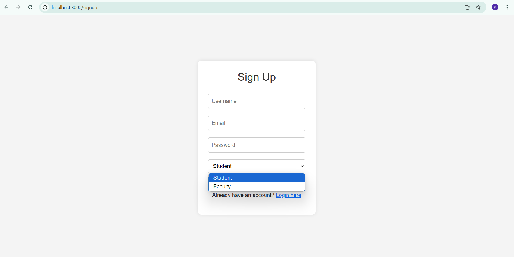

---

### 🧑‍💼 Admin View
- **Dashboard**  
  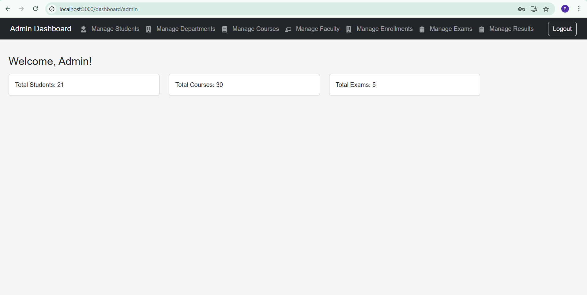

- **Courses Management**  
  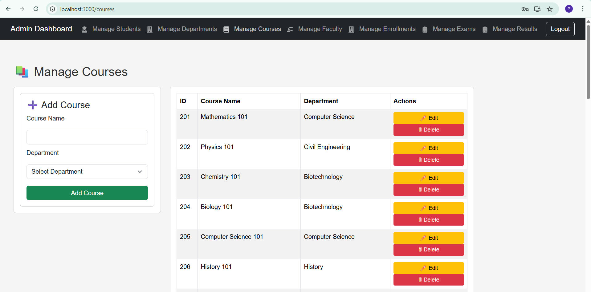

- **Exams Page**  
  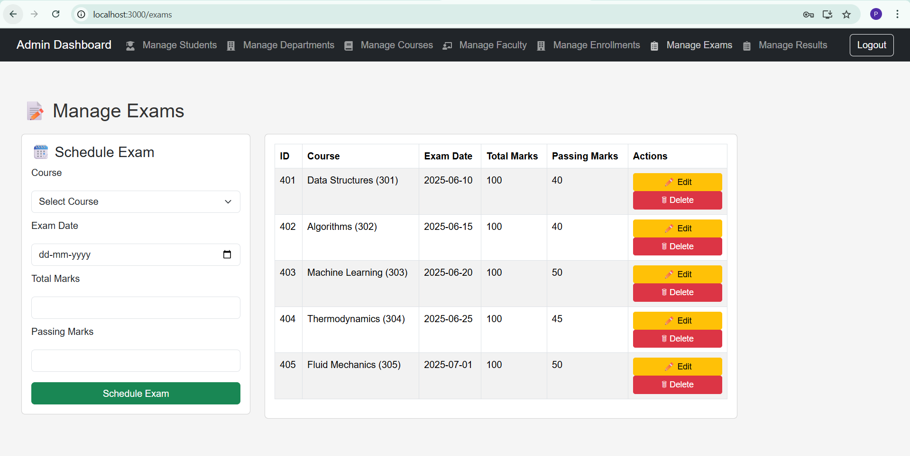
  
- **Exam Edit Mode**  
  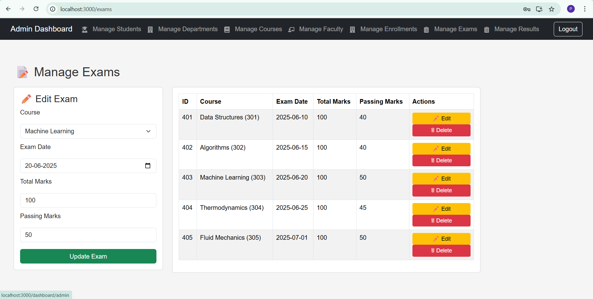

- **Enrollment List**  
  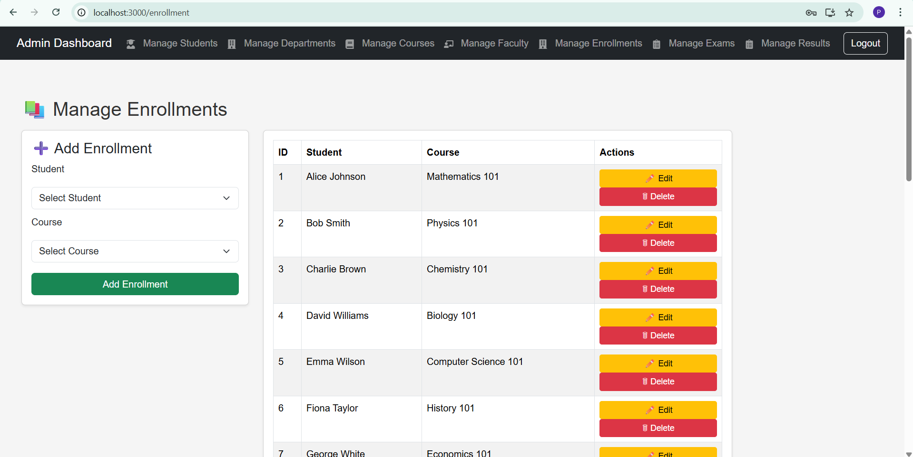

- **Enrollment Edit**  
  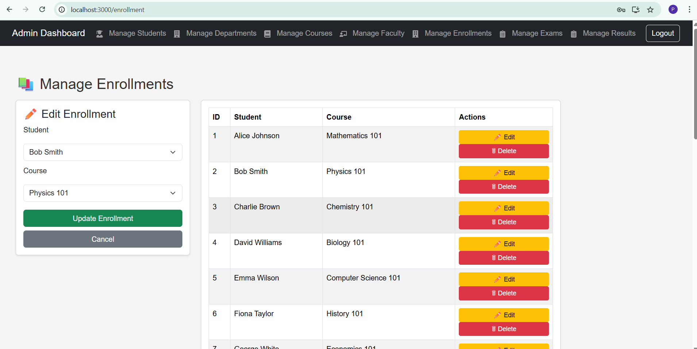

- **Responsive Admin Dashboard**  
  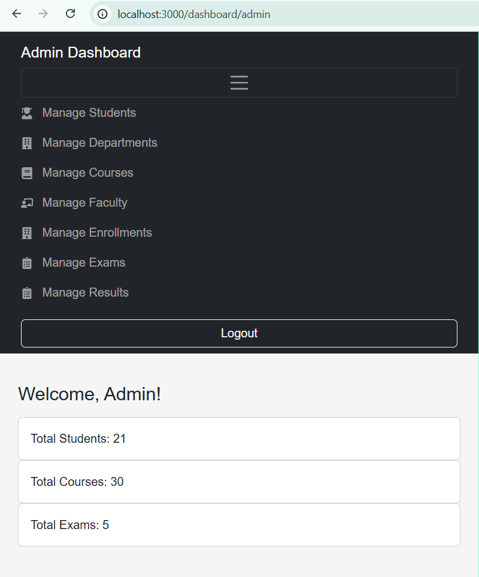

---

### 👨‍🏫 Faculty View
- **Dashboard**  
  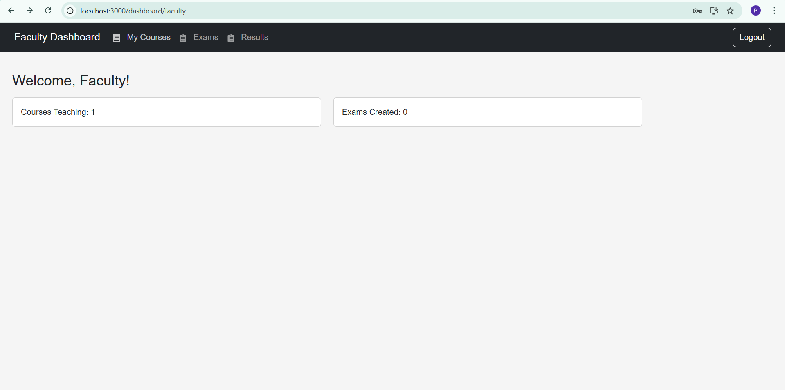

- **Courses**  
  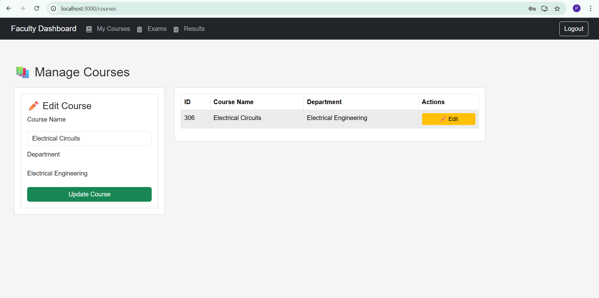

- **Results Management**  
  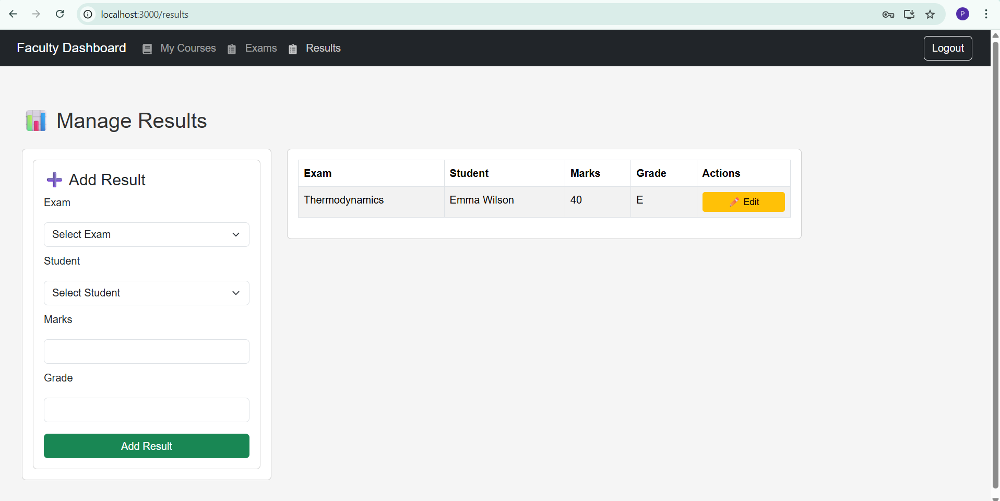

---

### 🎓 Student View
- **Dashboard**  
  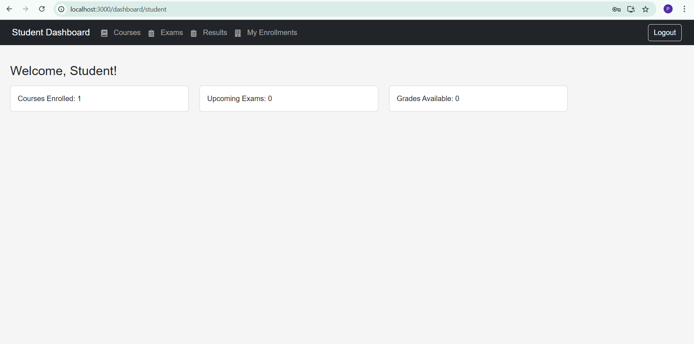

- **Results**  
  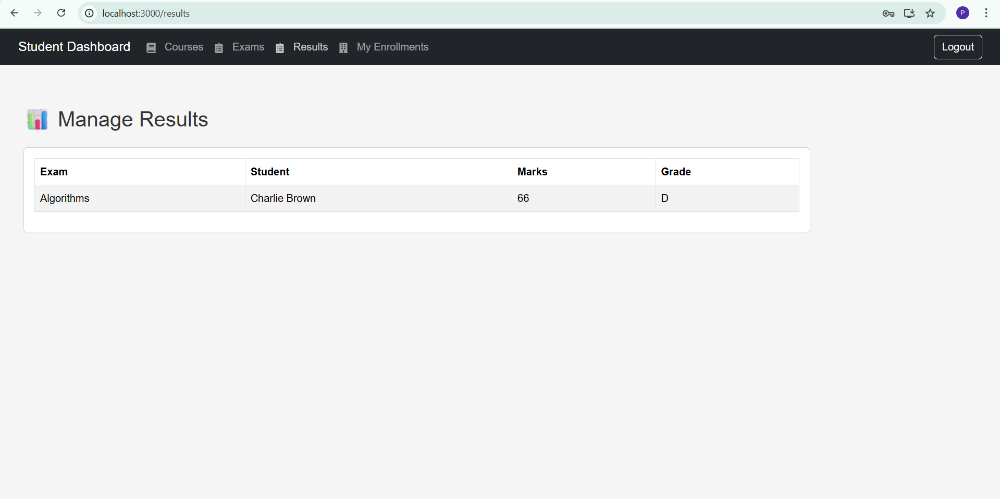

- **Enrollments**  
  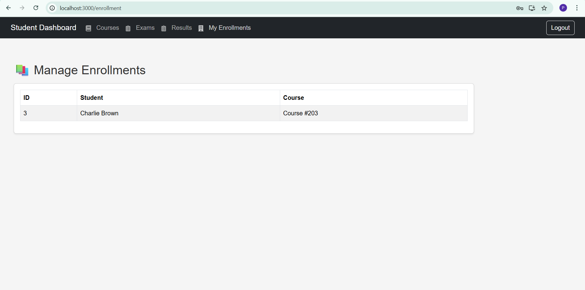

## 📄 License

This project is open-source and available for learning or educational use.

---

## ✅ To-Do (Future Enhancements)

* File upload for assignments
* PDF export for results
* Frontend pagination and filters
* Deployment (Render + Vercel/Netlify)

